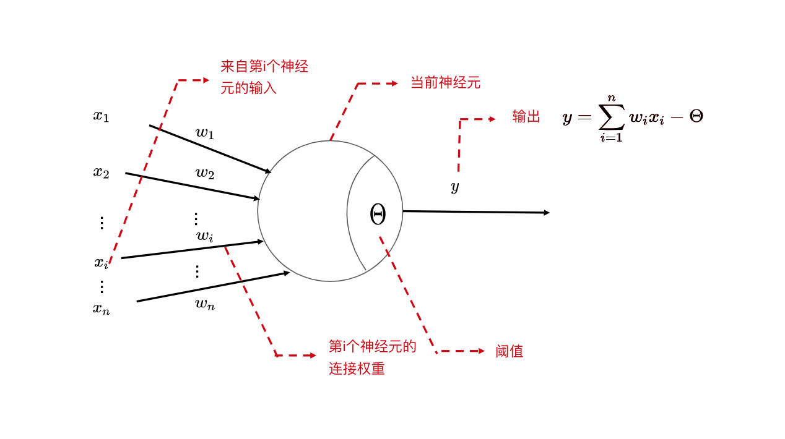

# 神经网络
## 1 神经元(neuron)模型
神经网络是由具有适应性的简单单元组成的广泛并行互连的网络，它的组织能够模拟生物神经系统对真实世界物体所做出的交互反应。
神经网络最基本的成分是神经元模型

### 1.1 M-P神经元模型
神经元接收到n个其他神经元传递过来的输入信号，这些输入信号通过带权重的连接进行传递，总输入与阈值进行比较，通过激活函数(activation function)进行输出

其中公式为$y=f(\displaystyle\sum_{i=1}^{n}w_ix_i-\Theta)$

理想的激活函数式阶跃函数：
$sgn(x)=\left\{\begin{matrix}
 1,&x\ge0; \\ 
 0,& x <0;
\end{matrix}\right.$
阶跃函数问题：不连续，不光滑.
因此时间常用Sigmoid函数作为激活函数：
$sigmoid(x) = \frac{1}{1+e^{-x}}$